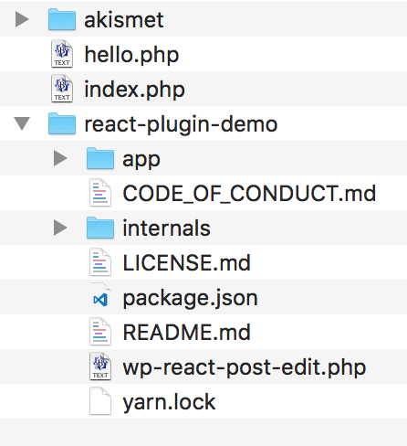
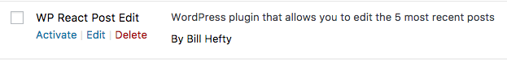
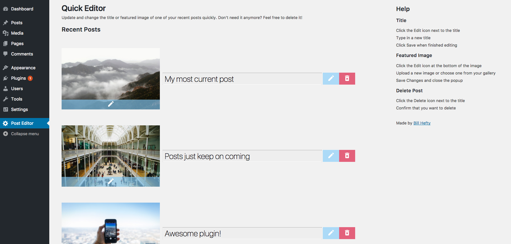

# WordPress Plugin - React Post Editor

<!-- Build status -->

<!-- Test coverage -->

<!-- depedency status -->

<!-- devDepedency status -->

### Task
Write a WordPress plugin that allows you to edit the 5 most recent posts (post title only). In addition to editing the post title - you should be able to delete any of the displayed posts.

### Requirements
- [x] The front-end of this plugin **must** be a JavaScript application written using the [React](https://facebook.github.io/react/) library.
- [x] The application **must** include some CSS styling
- [x] The application **must** be accessible from the WordPress admin menu
- [x] The application **must** display the 5 most recent WordPress posts
- [x] The application **must** support editing post titles for the displayed posts
- [x] The application **must** support deleting any of the displayed posts
- [x] When a post is deleted, the displayed posts **must** refresh to always keep at least 5 posts on display
- [x] Displayed posts **must** show their [featured image](http://www.wpbeginner.com/beginners-guide/how-to-add-featured-image-or-post-thumbnails-in-wordpress/) (if available)
- [x] **Extra credit** if the application allows changing the featured image of a displayed post

### Bonus Points
- [x] Include unit tests
- [x] Use at least ES6 as a JavaScript version
- [x] Leverage the latest version of [webpack](https://webpack.js.org/)

### Setup
1. Ensure a WordPress site is up and running (local or otherwise)
2. Nagivate to the `wp-content > plugins` folder
3. Git clone this repo to a folder such as `react-plugin-demo`. e.g.: `git clone https://github.com/bhefty/wp-react-post-edit.git react-plugin-demo`
4. Your `plugins` folder should look similar to this:
  
5. Cd into the newly cloned repo and run `npm install` or `yarn install`
6. Run `npm run build` or `yarn build`
7. Go to your WordPress site and navigate to the Plugins page on the admin panel
8. Find the new plugin and click Activate
  
9. Click on the new `Post Editor` button found on the left admin panel, and your last 5 posts will appear!
  

Alternatively, to conserve space, rather than keeping the entire repo within your WordPress site folder, you can house the repo elsewhere and run the build command. Then copy over **both** `wp-react-post-edit.php` and the `build` folder into a folder such as `react-plugin-demo` within the plugins folder of the WordPress site.